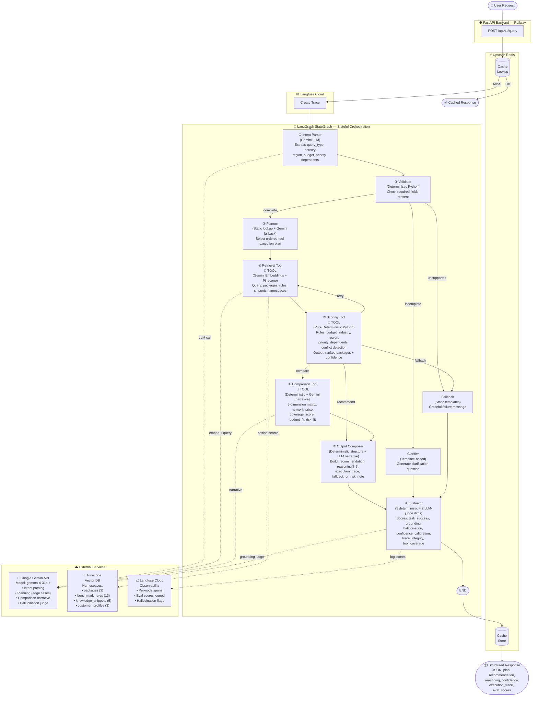
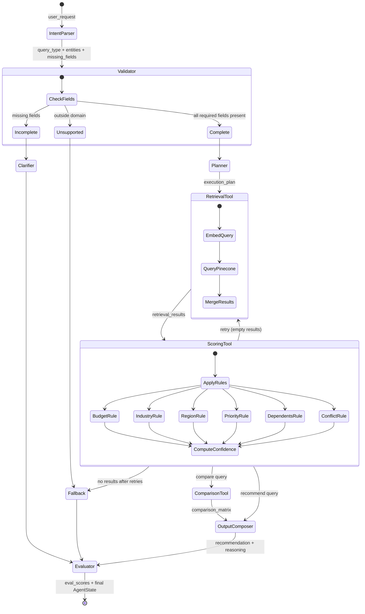

# Architecture Diagram — Agentic Insurance Advisor

## System Overview



---

## State Flow



---

## Data Model

### AgentState (TypedDict — shared across all nodes)

| Field | Type | Set By |
|-------|------|--------|
| `user_request` | `str` | API input |
| `thread_id` | `str` | API input |
| `query_type` | `QueryType` | Intent Parser |
| `extracted_entities` | `dict` | Intent Parser |
| `missing_fields` | `List[str]` | Validator |
| `execution_plan` | `List[str]` | Planner |
| `tools_used` | `List[str]` | Each tool |
| `retrieval_results` | `List[dict]` | Retrieval Tool |
| `retrieval_query` | `str` | Retrieval Tool |
| `scoring_results` | `List[dict]` | Scoring Tool |
| `scoring_breakdown` | `dict` | Scoring Tool |
| `comparison_matrix` | `dict` | Comparison Tool |
| `recommendation` | `dict` | Output Composer |
| `reasoning` | `List[str]` | Output Composer |
| `confidence` | `ConfidenceLevel` | Scoring Tool |
| `execution_trace` | `List[str]` | All nodes |
| `fallback_or_risk_note` | `str` | Output Composer / Fallback |
| `eval_scores` | `dict` | Evaluator |
| `retry_count` | `int` | Retrieval Tool |
| `error` | `dict` | Various nodes |
| `requires_clarification` | `bool` | Validator / Clarifier |
| `clarification_question` | `str` | Clarifier |

---

## Output Format (PDF Section 10 — Strict)

```json
{
  "user_request": "...",
  "plan": {
    "steps": ["retrieve relevant package knowledge", "apply scoring rules", "compose final recommendation"]
  },
  "tools_used": ["retrieval_tool", "scoring_tool"],
  "recommendation": {
    "plan_name": "Standard",
    "network": "B",
    "price_range": [6000, 7500]
  },
  "reasoning": [
    "driver 1",
    "driver 2",
    "driver 3"
  ],
  "confidence": "medium-high",
  "execution_trace": [
    "intent_parser: query_type=recommend, entities={...}",
    "planner: deterministic plan selected",
    "retrieval_tool: returned 11 documents",
    "scoring_tool: top package='Standard' score=90",
    "output_composer: generated 3 reasoning bullets",
    "evaluator: task_success=1.0, grounding=1.0"
  ],
  "fallback_or_risk_note": "..."
}
```
